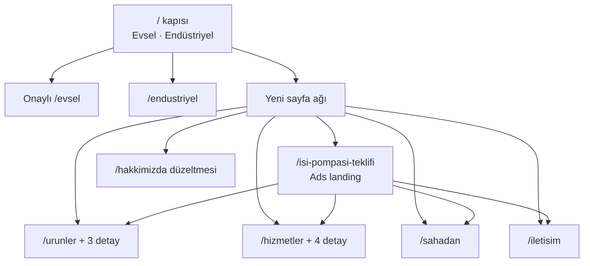
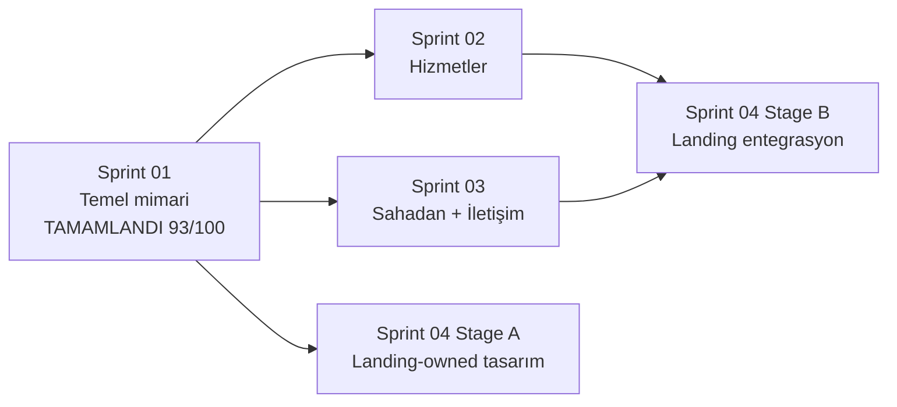

# Özdemir modern site — tüm genel planlar

Bu belge, epic içindeki dağınık spec, sprint, sözleşme ve strateji artifact’larını **tek okunur plan** olarak toplar. Kaynak kod veya git geçmişinin zaten cevapladığı uygulama kanıtlarını kopyalamaz. Kararlar yalnız yerleştikten sonra “karar” olarak yazılmıştır; açık sorular açık bırakılır.

**Derleme tarihi:** 23 Ağustos 2026.  
**Proje:** `C:\xampp\htdocs\özdemir-site` — Next.js 16 + React 19 + TypeScript + Tailwind v3.  
**Kaynak artifact’lar:** `autobuild/ozdemir-modern-site/{spec,rubric,sprint-*}` · `evsel-landing-stratejisi` · `urunler-canli-tasarim-kaniti`.

---

## 1. Niyet

Mevcut iki kollu siteyi (evsel / endüstriyel) bozmadan, aynı marka ve TypeScript yapısı içinde yeni sayfalar büyütmek. Hedef kitle **+35 Google Ads** ziyaretçisi: okunaklı, sakin, kanıt odaklı, telefon ve WhatsApp’a götüren bilgi mimarisi.

Kullanıcının asıl teslim beklentisi iskelet route değil: 21st.dev üzerinden tasarlanmış, özgün, mobil uyumlu gerçek sayfalar.

---

## 2. Yerleşmiş kararlar

| Konu               | Karar                                                                                                                                                                         | Kaynak                        |
| ------------------ | ----------------------------------------------------------------------------------------------------------------------------------------------------------------------------- | ----------------------------- |
| Ürün verisi        | Model/spec/görseller **taslak yer tutucu** olarak kullanılabilir; ziyaretçiye görünür “temsili/taslak” etiketi zorunlu. Yayın riski raporda yazılır.                          | Kullanıcı                     |
| Hizmetler          | Tek genel detay şablonu; içerik sonra güncellenir. Amaç SEO + GEO altyapısı. İlk 4 slug hazır.                                                                                | Kullanıcı                     |
| Dönüşüm            | Telefon + WhatsApp + kısa form. Form siteye kayıt yazmaz; doğrulama sonrası WhatsApp mesajı hazırlar.                                                                         | Kullanıcı                     |
| Landing yönü       | **Kanıt İlk Ekranda**                                                                                                                                                         | Spec + Qwen + Sprint 04 recon |
| Landing uygulayıcı | Yalnız GPT-5.6 Sol Max                                                                                                                                                        | Kullanıcı                     |
| 21st kullanımı     | Önce katalog aranır; seçilen fikir mevcut Tailwind v3 token’larına uyarlanır. Ham shadcn / Tailwind v4 yapıştırılmaz. Generate kotası kilitliyken katalog referansıyla devam. | Planner + 21st CLI            |
| Sahadan kanıt      | Gerçek vaka kaydı yokken vaka kartı yok. “Vaka arşivi hazırlanıyor”. Stok görsel ayrı “Temsili görsel seçki — vaka kanıtı değildir” katmanında.                               | Planner, Sprint 03 recon      |
| Form hukuku        | Taslak KVKK/Gizlilik resmi rıza kutusu olmaz. “Bilgileriniz bu siteye kaydedilmez; mesajı WhatsApp’ta siz gönderirsiniz.”                                                     | Planner                       |
| Legal sayfalar     | Dışarıdan gelen `/gizlilik` ve `/kvkk` silinmez; görünür “Taslak — hukuki inceleme bekliyor”, `noindex`, sitemap dışı. Hukuki onay değildir.                                  | Kullanıcı                     |
| Paralel uygulama   | Sprint 02/03/04 ayrı Git worktree; çift verdict olmadan ana ağaca merge yok.                                                                                                  | Kullanıcı + Planner           |
| Evsel metin        | Onaylı `/evsel` copy ve anlamı korunur.                                                                                                                                       | Spec                          |
| Sahte içerik       | Uydurma müşteri yorumu, proje sayısı, kapasite, tasarruf, performans veya yasal metin yok.                                                                                    | Spec / rubrik                 |

Açık kalanlar (karar gibi yazılmaz):

- Gerçek ürün kataloğu, fotoğraf ve teknik föy.
- İzinli müşteri alıntısı ve gerçek vaka kayıtları.
- Hukuk danışmanı onaylı KVKK / Gizlilik / Kullanım Şartları.
- Google Ads / Analytics dönüşüm etiketlerinin hesap tarafında kurulması.
- Yerel tarayıcıda piksel / breakpoint son kontrolü (`manual visual audit pending`).

---

## 3. Route ve sayfa şekli

| Route                                   | Amaç                       | Ana bloklar                                                                      | Sprint                                 |
| --------------------------------------- | -------------------------- | -------------------------------------------------------------------------------- | -------------------------------------- |
| `/`                                     | Evsel / endüstriyel kapısı | Mevcut Splash; tek `sr-only` H1, görünür kol başlıkları H2                       | 01                                     |
| `/evsel`                                | Onaylı evsel ana sayfa     | Mevcut içerik korunur                                                            | Korunur                                |
| `/endustriyel`                          | Endüstriyel kol            | Mevcut içerik                                                                    | 01 (metadata)                          |
| `/hakkimizda`                           | Kurumsal doğruluk          | 8 yıl / 2 şube / 3 il; eski 12 yıl / 600+ / 18 MW yok                            | 01                                     |
| `/urunler`                              | Ürün / sistem merkezi      | Hero, marka başarıları, 3 aile kartı, seçim rehberi, süreç, CTA                  | Planner canlı tasarım + S02 sözleşmesi |
| `/urunler/monoblok-isi-pompasi`         | Monoblok detay             | Hero, uygunluk, sistem akışı, 6 faz, SSS, CTA                                    | Planner canlı tasarım                  |
| `/urunler/split-isi-pompasi`            | Split detay                | Aynı şablon, aileye özel içerik                                                  | Planner canlı tasarım                  |
| `/urunler/ticari-kaskad-isi-pompasi`    | Ticari / kaskad detay      | Aynı şablon, aileye özel içerik                                                  | Planner canlı tasarım                  |
| `/hizmetler`                            | Hizmet hub                 | Dört hizmet ailesi, süreç, kanıt, CTA                                            | 02                                     |
| `/hizmetler/isi-pompasi-kurulumu`       | Hizmet detay               | Answer-first, kapsam, kimler için, süreç, ürün, kanıt, SSS, CTA                  | 02                                     |
| `/hizmetler/mekanik-tesisat`            | Hizmet detay               | Aynı şablon, özgün içerik                                                        | 02                                     |
| `/hizmetler/projelendirme-devreye-alma` | Hizmet detay               | Aynı şablon, özgün içerik                                                        | 02                                     |
| `/hizmetler/bakim-servis`               | Hizmet detay               | Aynı şablon, özgün içerik                                                        | 02                                     |
| `/sahadan`                              | Kanıt merkezi              | Metodoloji + “vaka arşivi hazırlanıyor” + temsilî galeri (ayrı etiket)           | 03                                     |
| `/iletisim`                             | Yerel güven + başvuru      | İki adres/harita, iki telefon, WhatsApp, saat, kısa form                         | 03                                     |
| `/isi-pompasi-teklifi`                  | Google Ads landing         | Kanıt-öncelikli hero, ödül/marka, süreç, ürün, sahadan, itiraz, form, sticky CTA | 04                                     |
| `/gizlilik`                             | Yasal taslak               | Görünür taslak uyarısı, noindex                                                  | 01 reconciliation                      |
| `/kvkk`                                 | Yasal taslak               | Görünür taslak uyarısı, noindex                                                  | 01 reconciliation                      |

İlk hizmet config kaynağı tek dosyadan güncellenebilir: `src/config/services.ts`.

---

## 4. Tasarım ve teknik kısıtlar

- 21st.dev önce aranır; Lucide ikon dili veya projedeki mevcut Lucide seti.
- Gerçek logo, Manrope / Inter, mevcut mavi / ısı paleti korunur.
- Aşırı gradient, glass, kart duvarı, dekoratif hareket yok.
- Mobil-first; klavye / focus; reduced-motion; semantik HTML; en az 44 px dokunma hedefi.
- Yeni route’larda tek H1, benzersiz metadata / canonical, parse edilebilir JSON-LD.
- Next.js 16: `params: Promise`, `generateStaticParams`, `generateMetadata`; bilinmeyen slug `notFound()`.
- Var olan kirli çalışma ağacı korunur; reset, toplu üzerine yazma, onaylı evsel metin değişikliği yok.
- CTA söylemi tek tip: **“Ücretsiz keşif”**. İndirim / kıtlık dili yok.

### 21st katalog referansları (uyarlanır, kopyalanmaz)

| ID                      | Kullanıldığı yer        | Alınacak                            | Alınmayacak                     |
| ----------------------- | ----------------------- | ----------------------------------- | ------------------------------- |
| 2202 About 3            | Hub / landing kanıt     | Görsel + firma kanıtı kompozisyonu  | Sahte logo ve istatistik        |
| 25224 Contact 01        | İletişim / landing form | Bilgi + kısa form iki sütun         | Shadcn paketi, ajans metni      |
| 692 Gallery cards       | Sahadan / landing       | Görsel üstünde kısa bağlam          | Yalnız dekoratif galeri         |
| 6277 How It Works       | Hizmet / landing süreç  | Ardışık adımlar                     | Generic İngilizce, shadcn token |
| 19168 Carousel Cards    | Ürün şerit / landing    | Mobil snap, oklar                   | Fiyat / puan / sahte stok       |
| 8223 Service Card       | Hizmet hub              | Başlık + gerçek URL CTA             | CVA / shadcn, dekorasyon        |
| 21465 Logo Cloud        | Ürün merkezi            | Eşit ağırlıklı marka şeridi         | “Trusted by” müşteri semantiği  |
| 4519 Achievement Cards  | Ürün merkezi            | Logo + başarı hiyerarşisi           | Uydurma sayı                    |
| 8286 Product Card       | Ürün ailesi             | Görsel, açıklama, uygunluk, tek CTA | E-ticaret sepet / fiyat         |
| 8557 Product Detail     | Ürün detay              | Sistem + uygunluk + CTA             | Puan / sepet                    |
| 19863 Timeline          | Ürün / hizmet fazları   | Altı uygulama fazı                  | Generic İngilizce               |
| 2207 FAQ                | Detay SSS               | Aileye özel sorular                 | Sahte review                    |
| 19080 Hero              | Landing hero            | Net H1 / lead, sakin görsel         | Arama kutusu, remote görsel     |
| 21466 Logo Cloud + CTA  | Landing trust           | Kanıt ile logo ayrımı               | “Trusted by”, kart duvarı       |
| 23564 Inline Validation | Form a11y               | label, aria-invalid, hata ilişkisi  | Debounce animasyon, shadcn      |
| 5964 Project Card       | Sahadan kart anatomisi  | Görselden bağımsız doğrulanmış alan | Zoom zorunluluğu, dış görsel    |

---

## 5. SEO + GEO omurgası

- Her route: benzersiz title / description, canonical, Open Graph, tek H1.
- Kurum varlığı: `HVACBusiness` / `Organization` (`${SITE_URL}/#organization`).
- Sayfaya göre: `Service`, `CollectionPage` / `ItemList`, `ContactPage`, `BreadcrumbList`; gerçek sorular varsa `FAQPage`.
- JSON-LD içinde `<` sanitize edilir.
- Sitemap yalnız gerçek, indekslenebilir route’ları içerir. Taslak yasal sayfalar ve sahte katalog öğeleri indekslenmez.
- Answer-first özetler, açık kapsam / uygunluk, hizmet bölgeleri (Balıkesir, Bursa, Çanakkale), marka ilişkileri ve iç link ağı hem arama hem üretken arama için varlık ağı kurar.
- Aynı paragrafı slug’lar arasında kopyalamak yasak; config alanları hizmete / ürüne özgü title, özet, kapsam, kanıt ve SSS sağlar.

---

## 6. Dönüşüm mimarisi

| Katman    | Aksiyon                                        | Kullanım                                                                          |
| --------- | ---------------------------------------------- | --------------------------------------------------------------------------------- |
| Birincil  | Telefon `tel:+905421869090` — “Ücretsiz keşif” | Hero, finder, footer, mobil sticky                                                |
| İkincil   | WhatsApp (`WHATSAPP_HREF`)                     | Footer + sticky ikincil                                                           |
| Üçüncül   | 7/24 hat `+90 216 606 08 70`                   | Mesai dışı güvenlik ağı; `site.ts` kaynağı olmadan yeni “7/24” iddiası türetilmez |
| Dördüncül | Kısa keşif formu                               | Siteye kayıt yok; WhatsApp draft                                                  |

**Form alanları**

| Alan                | Zorunlu  | Not                                                    |
| ------------------- | -------- | ------------------------------------------------------ |
| Ad soyad            | Evet     |                                                        |
| Telefon             | Evet     |                                                        |
| İl                  | Evet     | Balıkesir / Bursa / Çanakkale / Diğer                  |
| İlçe                | Hayır    | Boşsa mesajdan çıkar                                   |
| Ev / yapı büyüklüğü | Hayır    | Finder bantları: &lt;100 / 100–150 / 150–220 / 220+ m² |
| Mevcut ısıtma       | Hayır    | Tek opsiyonel ek                                       |
| E-posta             | Sorulmaz |                                                        |
| KVKK checkbox       | **Yok**  | Taslak metin rıza sayılmaz                             |

Görünür açıklama (exact): **“Bilgileriniz bu siteye kaydedilmez; mesajı WhatsApp’ta siz gönderirsiniz.”**  
“Gönderildi / talebiniz kayda alındı” denmez.

KPI (ölçüm noktaları kodda hazırlanır; hesap kurulumu kapsam dışı):

1. Telefon araması (Ads çağrı dönüşümü)
2. Form → WhatsApp draft
3. WhatsApp tıklaması

İlk 2 hafta taban ölçümü; uydurma sayısal hedef yok.

---

## 7. +35 landing stratejisi (Qwen 3.8 Max)

Kaynak: onaylı `/evsel` metinleri ve config. Yer tutucu spek / boş reels / sahte testimonial stratejiye girmez.

### Mesaj hiyerarşisi

1. Bölge + hizmet eşleşmesi — Bandırma, Balıkesir, Bursa, Çanakkale’de evsel ısı pompası
2. Isıtma + serinletme + sıcak su, tek sistem
3. Risk tersine çevirme: ücretsiz keşif, yükümlülüksüz teklif
4. Güven: 8 yıl + 3 ödül + Burak Özdemir + iki adres
5. Kolaylık: keşif → teklif → kurulum → devreye alma → güvence
6. Vade farksız 6 taksit
7. Satış sonrası: 2 yıl güvence + ücretsiz servis ziyareti + 7/24 hat

### Doğrulanmış güven varlıkları

| Varlık                                                     | Kaynak                |
| ---------------------------------------------------------- | --------------------- |
| 8 yıl deneyim; sahip Burak Özdemir işin başında            | `site.ts`, `about.ts` |
| Bosch 2024 en çok satış yapan yetkili bayi                 | `about.ts`            |
| NIBE Güney Marmara birinciliği; Gram Power Türkiye 5.’liği | `about.ts`            |
| Ücretsiz yerinde keşif (3 il); teklif keşiften sonra       | `faq.ts`              |
| Vade farksız 6 taksit                                      | `faq.ts`              |
| 2 yıl Özdemir Mühendislik güvencesi                        | `faq.ts`              |
| 7/24 müşteri temsilcisi; randevu 09.00–18.00               | `site.ts`             |
| Bandırma merkez + Biga şubesi                              | `site.ts`             |
| Slogan: “Doğalgaz yoksa ısı pompası var”                   | `site.ts`             |

**Kullanılamaz:** `products.ts` kW/m²/°C spekleri; boş reels; gerçek müşteri yorumu; elektrik faturası / soğuk iklim iddiası (onaylı metin yok).

### Sosyal kanıt sırası

1. Ödüller (Bosch → NIBE → Gram Power)
2. Sahip / ekip, isim ve yüzle
3. Saha galerisi — yalnız gerçek vaka kaydı varsa
4. Belgeli deneyim kartları (ödül / deneyim / güvence)
5. Gerçek müşteri ifadesi toplanana kadar “müşteri yorumu” başlığı açılmaz

### İtiraz karşılama (onaylı yanıtlardan)

| İtiraz             | Yanıt omurgası                                                                   |
| ------------------ | -------------------------------------------------------------------------------- |
| Fiyat?             | Keşiften sonra netleşir                                                          |
| Keşif ücretsiz mi? | Evet                                                                             |
| Hangi marka?       | Bosch / NIBE premium; Gram Power / Varmeks fiyat-performans; doğru marka keşifte |
| Ödeme?             | Vade farksız 6 taksit                                                            |
| Arıza?             | 2 yıl güvence, ücretsiz servis ziyareti, 7/24 hat                                |
| Bunlar kim?        | 8 yıl, ödüller, sahip adı, iki adres                                             |
| Bölge?             | 3 il; uygunluk netleşmeden randevu sözü yok                                      |

### Landing bölüm akışı (`/isi-pompasi-teklifi`)

| Sıra | Bölüm                                                                 |
| ---- | --------------------------------------------------------------------- |
| 1    | Kompakt header: logo + telefon + WhatsApp; tam menü yok               |
| 2    | Proof-first hero: H1, ücretsiz keşif, kanıt satırı, statik görsel     |
| 3    | Kanıt ve marka bandı (ödül ile “çalıştığımız markalar” semantik ayrı) |
| 4    | 5 adımlı süreç                                                        |
| 5    | Ürün görünürlüğü (Sprint 02 export; specsiz + taslak etiketi)         |
| 6    | Sahadan (Sprint 03 export; yoksa dürüst boş durum)                    |
| 7    | SSS / itirazlar (exact 7 onaylı soru)                                 |
| 8    | İletişim + kısa form (masaüstü iki sütun)                             |
| 9    | Footer + mobil sticky CTA                                             |

Reddedilen alternatif yönler: **Keşif Rehberi** (form birincil olur, kanıt gecikir) ve **Sahadan Hikâye** (stok medya güveni tersine çevirir).

Önerilen title: `Isı Pompası Teklifi | Bandırma, Balıkesir, Bursa, Çanakkale`.

---

## 8. Sprint planı

### Roller

| Rol                   | Model                            | Görev                                     |
| --------------------- | -------------------------------- | ----------------------------------------- |
| Planner / orkestratör | GPT-5.6 Sol Max                  | Spec, karar, rubrik, release, son denetim |
| Dönüşüm stratejisti   | Qwen 3.8 Max                     | +35 Ads, CTA, itiraz — tamamlandı         |
| Bilgi mimarisi        | GLM 5.3                          | İki deneme çıktı vermedi; katkı yok       |
| Sprint 01 Generator   | GPT-5.6 Sol High                 | Temel mimari — tamamlandı                 |
| Sprint 02 Generator   | GPT-5.6 Terra High               | Hizmetler worktree                        |
| Sprint 03 Generator   | GPT-5.6 Terra High               | Sahadan / iletişim worktree               |
| Sprint 04 Generator   | GPT-5.6 Sol Max                  | Landing worktree                          |
| Evaluator’lar         | GPT-5.6 Sol / Sol High / Sol Max | Bağımsız contract + rubrik                |

Döngü sınırları: sprint başına en fazla 3 contract exchange + 3 eval turu; rol başına 1 restart; sonra kullanıcıya eskalasyon. Bir sprint yalnız **contract VE rubrik** birlikte geçince tamamlanır.

### Sprint 01 — Temel mimari ve kurumsal tutarlılık

**Amaç:** Ortak route / SEO / CTA; gerçek nav-footer; `/hakkimizda` doğruluk.

**Teslim:** typed route kaydı, metadata helper, JSON-LD, sitemap / robots, `ContactActions`, `lead.ts` + test, dört içerik kabuğu (sonradan gerçek tasarımlarla değiştirildi), legal taslak entegrasyonu, StatCounter SSR 8/2/3, global 21st a11y cleanup (`HeroDebug`, `IndustrialHeroImage`, `Splash`).

**İstisnalar (dar, Planner onaylı):**

- Kök: `sr-only` H1; görünür Evsel / Endüstriyel H2.
- StatCounter: reduced-motion + SSR ilk HTML’de gerçek değer; count-up güvenli olmadığı için kaldırıldı.
- Legal: görünür taslak, noindex.

**Durum:** Contract PASS + Rubric PASS **93/100**. Manual browser audit pending.

### Sprint 02 — Ürün ve hizmet altyapısı

**Amaç (sözleşme):** `/hizmetler` hub + 4 config-driven detay. Ürün hub’ı Planner tarafından canlı tasarım olarak öne alındı; Sprint 02 Generator ürün alanına yazmaz (root-owned / read-only).

**Seçilen tasarım yönü:** A (kanıt çıpalı editoryal) + B (rehber / süreç), C’nin erişilebilirlik kurallarıyla.

**Owned write-set:** `src/config/services.ts`, `src/app/hizmetler/[slug]/page.tsx`, `src/components/services/*`.  
**Shared handoff:** `src/app/sitemap.ts` içine dört canonical hizmet URL’si (Navbar / Footer / routes Planner izni olmadan değişmez).

**İçerik kuralı:** dört kaydın her biri ayrı title, description, answer, kapsam, uygunluk, süreç, ürün ref, kanıt, SSS. Başlık değiştirip aynı paragrafı çoğaltmak fail.

**Durum:** Contract PASS; uygulama worktree’de. Ürün detay katmanı Planner teslimi (aşağıda).

### Sprint 03 — Sahadan ve iletişim

**Amaç:** `/sahadan` galeriden kanıt merkezine; `/iletisim` iki lokasyon + WhatsApp formu.

**Sahadan planı (veri yokken):**

1. Üst katman: 8 yıl, 3 ödül, iki şube, belgeleme metodolojisi
2. Görünür “Vaka arşivi hazırlanıyor”
3. Ayrı temsilî görsel seçki — vaka kanıtı değildir
4. Vaka kartı yok

**İletişim planı:** iki tam adres + Maps, iki `tel:`, WhatsApp, 09.00–18.00, süreç beklentisi (onaysız süre sözü yok), `lead.ts` helper, a11y hataları, popup fallback.

**Test-harness addendum (DG-12):** Vitest + jsdom + Testing Library. Kanıtlanacaklar: ilk hatalı alana focus, aria hata ilişkisi, popup fallback, düzeltilmiş ikinci submit, klavye-only, no-store / no native POST.

**Owned write-set:** `sahadan/page.tsx`, `iletisim/page.tsx`, `components/sahadan/*`, `components/iletisim/*`, `config/field-work.ts`, addendum test yüzeyleri.

**Durum:** Contract PASS + addendum PASS; uygulama worktree’de.

### Sprint 04 — Ads landing ve bütünsel doğrulama

**Amaç:** `/isi-pompasi-teklifi` + sticky CTA + tüm route metadata / JSON-LD / sitemap / iç-link doğrulaması.

**Owned write-set:** `src/app/isi-pompasi-teklifi/page.tsx`, `src/config/heat-pump-offer.ts` (+ test), `src/components/landing/heat-pump-offer/*`.

**Stage A:** bağımlılıksız landing-owned tasarım.  
**Stage B:** S02/S03 typed export ve form/vaka yüzeyi çift verdict sonrası bağlanır; shared routes / sitemap / SEO son elde Planner birleştirir.

**Durum:** Contract v0.2 PASS; Stage A worktree’de başladı.

### Paralel worktree kararı

Aynı klasörde full-tree hash kapılarının birbirini kilitlememesi için:

| Sprint | Branch / worktree                 |
| ------ | --------------------------------- |
| 02     | `traycer/sprint-02-services`      |
| 03     | `traycer/sprint-03-field-contact` |
| 04     | `traycer/sprint-04-landing`       |

Hiçbir child agent ana worktree’ye merge / commit / reset / stash yapmaz. Planner owned byte setini çift verdict sonrası atomik taşır.

---

## 9. Ürün katmanı planı (Planner canlı tasarım)

Sprint sözleşmesindeki `/urunler` kabuğu, kullanıcı “iskelet değil gerçek sayfa” talebinden sonra Planner tarafından doğrudan tasarlandı. Bu, Sprint 02 Generator’ın ürün alanını okunur / korumalı bırakma kararını da üretti.

### Ürün merkezi (`/urunler`)

1. Answer-first hero + sistem diyagramı
2. Üç doğrulanmış marka başarısı (Bosch, NIBE, Gram Power)
3. Üç sistem ailesi kartı
4. Dört maddeli seçim rehberi
5. Dört adımlı keşif → teklif süreci
6. Bölgesel ücretsiz keşif CTA

Sahte model, kapasite, fiyat, performans yok. Spek yayından kalkar; marka düzeyi görünürlük + “doğru marka keşifte belirlenir”.

### Üç detay rotası

Her biri aynı TypeScript şablonundan, aileye özel içerikle:

- `/urunler/monoblok-isi-pompasi`
- `/urunler/split-isi-pompasi`
- `/urunler/ticari-kaskad-isi-pompasi`

Bloklar: hero + sistem şeması, uygunluk, seçim kontrol noktaları, üç katmanlı sistem akışı, **altı uygulama fazı**, dört aileye özel SSS, diğer ailelere geçiş, keşif CTA, unique metadata / canonical / WebPage + FAQPage + Breadcrumb JSON-LD. Geçersiz slug 404.

---

## 10. Değerlendirme rubriği

Geçiş: **en az 85/100** ve tüm non-negotiable’lar. Contract geçip rubrik kalırsa sprint tamamlanmaz.

| Kriter                     | Ağırlık | Güçlü görüş                                                                                |
| -------------------------- | ------- | ------------------------------------------------------------------------------------------ |
| Tasarım sistemi + özgünlük | 25      | Özdemir devamı; generic SaaS/AI landing değil. 21st izlenebilir dönüştürülür, kopyalanmaz. |
| Doğruluk + güven           | 20      | Taslak ile gerçek kanıt ayırt edilir.                                                      |
| +35 dönüşüm ve hiyerarşi   | 20      | İlk ekran ne / nerede / nasıl iletişim.                                                    |
| SEO + GEO                  | 15      | Benzersiz, semantik, birbirine bağlı.                                                      |
| Craft, işlev, a11y         | 20      | Taşma yok; focus, klavye, form, 404, CTA üretim kalitesi.                                  |

**Non-negotiable**

- Onaylı evsel metin silinmez / anlamı değişmez.
- Uydurma iddia / testimonial / yasal metin yok; taslak ürün işaretli.
- Tailwind v4 veya tanımsız shadcn token yok.
- Kırık link, `#` ana CTA, bilinmeyen slug’da 200, sessiz form başarısızlığı yok.
- lint, TypeScript, production build geçer; 21st review error = 0.
- Tek H1, unique metadata / canonical, parse edilebilir JSON-LD.
- 360 px yatay taşma yok; 44 px; görünür focus; reduced-motion.

**Doğrulama komutları:** `npm run lint` · `npx tsc --noEmit` · `npm run build` · `npm run dev -- --port 3000` · `21st review --strict` · HTTP 200/404 · HTML smoke · lead / form testleri.  
Bağlı tarayıcı yokken “görsel olarak doğrulandı” denemez.

---

## 11. Kapsam dışı

- Gerçek ürün kataloğu ve teknik föyler
- İzinli müşteri alıntıları ve gerçek proje sonuç ölçümleri
- Hukuk onaylı politika metinleri
- Ads / Analytics hesap kurulumu (kod yalnız ölçüm noktalarını hazırlar)
- 21st generate kotası / plan yükseltme
- GLM 5.3 katkı kaydı (çıktı yok)
- Ana sayfa evsel copy rewrite (sıra Qwen önerisiyle kısmen uygulandı; anlam korunur)

---

## 12. Kaynak artifact dizini

| Plan                                  | Yol                                                                               |
| ------------------------------------- | --------------------------------------------------------------------------------- |
| Yüksek seviye spec                    | `artifacts/autobuild/ozdemir-modern-site/spec/`                                   |
| Rubrik                                | `artifacts/autobuild/ozdemir-modern-site/rubric/`                                 |
| Sprint panosu                         | `artifacts/autobuild/ozdemir-modern-site/`                                        |
| +35 strateji                          | `artifacts/evsel-landing-stratejisi/`                                             |
| Sprint 01–04 story / contract / recon | `artifacts/autobuild/ozdemir-modern-site/sprint-0{1,2,3,4}/`                      |
| Ürün canlı tasarım                    | `artifacts/urunler-canli-tasarim-kaniti/`                                         |
| Sprint 01 release                     | `artifacts/autobuild/ozdemir-modern-site/releases/sprint-01-final-v2/`            |
| Paralel worktree baseline             | `artifacts/autobuild/ozdemir-modern-site/releases/parallel-worktree-baseline-01/` |

